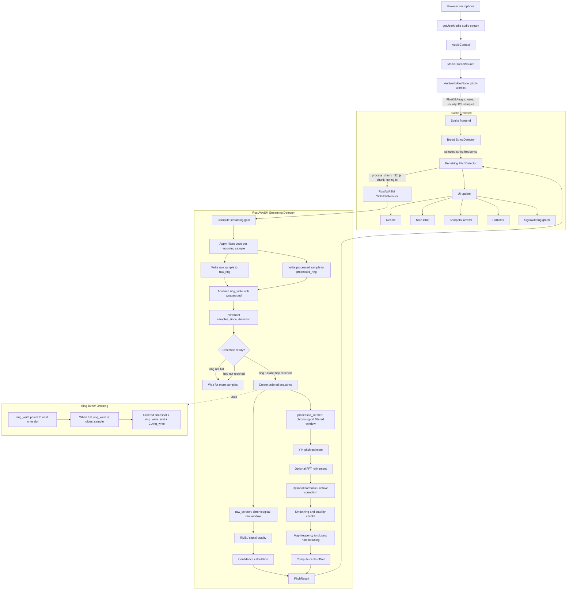
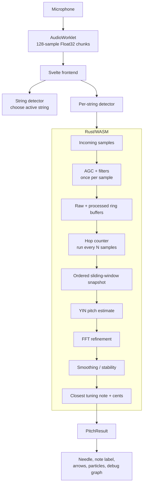

# Architecture

## Pitch Detection Flow

```mermaid
flowchart TD
    A[Browser microphone] --> B[getUserMedia audio stream]
    B --> C[AudioContext]
    C --> D[MediaStreamSource]
    D --> E[AudioWorkletNode: pitch-worklet]

    E -->|Float32Array chunks, usually 128 samples| F[Svelte frontend]

    subgraph FE[Svelte Frontend]
        F --> G[Broad StringDetector]
        G -->|selected string frequency| H[Per-string PitchDetector]
        H -->|process_chunk_f32_js chunk, tuning id| I[Rust/WASM YinPitchDetector]
        H --> J[UI update]
        J --> J1[Needle]
        J --> J2[Note label]
        J --> J3[Sharp/flat arrows]
        J --> J4[Particles]
        J --> J5[Signal/debug graph]
    end

    subgraph WASM[Rust/WASM Streaming Detector]
        I --> K[Compute streaming gain]
        K --> L[Apply filters once per incoming sample]
        L --> M[Write raw sample to raw_ring]
        L --> N[Write processed sample to processed_ring]
        M --> O[Advance ring_write with wraparound]
        N --> O
        O --> P[Increment samples_since_detection]

        P --> Q{Detection ready?}
        Q -->|ring not full| R[Wait for more samples]
        Q -->|hop not reached| R
        Q -->|ring full and hop reached| S[Create ordered snapshot]

        S --> T[raw_scratch: chronological raw window]
        S --> U[processed_scratch: chronological filtered window]

        U --> V[YIN pitch estimate]
        V --> W[Optional FFT refinement]
        W --> X[Optional harmonic / octave correction]
        X --> Y[Smoothing and stability checks]
        T --> Z[RMS / signal quality]
        Y --> AA[Map frequency to closest note in tuning]
        Z --> AB[Confidence calculation]
        AA --> AC[Compute cents offset]
        AB --> AD[PitchResult]
        AC --> AD
    end

    AD --> H

    subgraph RB[Ring Buffer Ordering]
        RB1[ring_write points to next write slot]
        RB2[When full, ring_write is oldest sample]
        RB3[Ordered snapshot = ring_write..end + 0..ring_write]
        RB1 --> RB2 --> RB3
    end

    S -. uses .-> RB
```

## Simplified View

```mermaid
flowchart TD
    Mic[Microphone] --> Worklet[AudioWorklet<br/>128-sample Float32 chunks]
    Worklet --> UI[Svelte frontend]
    UI --> String[String detector<br/>choose active string]
    UI --> Pitch[Per-string detector]
    Pitch --> WASM[Rust/WASM streaming state]

    subgraph WASM[Rust/WASM]
        In[Incoming samples] --> Filter[AGC + filters<br/>once per sample]
        Filter --> Ring[Raw + processed ring buffers]
        Ring --> Hop[Hop counter<br/>run every N samples]
        Hop --> Snapshot[Ordered sliding-window snapshot]
        Snapshot --> Yin[YIN pitch estimate]
        Yin --> FFT[FFT refinement]
        FFT --> Smooth[Smoothing / stability]
        Smooth --> Note[Closest tuning note + cents]
    end

    Note --> Result[PitchResult]
    Result --> UIOut[Needle, note label,<br/>arrows, particles, debug graph]
```
