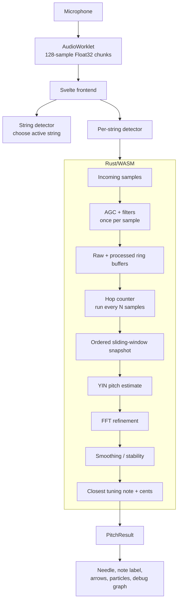

# No-Fuzz Guitar Tuner

nofuzz-tuner is a free, no-nonsense, no-strings-attached, online tuner for guitars. I built it 'cause I wanted a tuner without ads.

https://www.nofuzz.app/

For Developers curious about Rust-WASM integration or audio processing in the browser: Feel free to do whatever you want with this code.

## Architecture

See [ARCHITECTURE.md](./ARCHITECTURE.md) for the detailed pitch detection flow.



## Tech Stack

Your browser handles everything. No data leaves your device.

The core audio processing (frequency detection) is Rust + WebAssembly (WASM).

The UI is Svelte. Svelte compiles UI components into highly efficient JavaScript.

Rust/WASM + Svelte results in a tuner that feels quite responsive in the browser.

## Setup and Running Locally

Prerequisites: You need Rust (with Cargo), Node.js and npm, and wasm-pack installed on your system.

### Running the Command-Line Tuner (Rust backend)
Run the tuner logic in a simple command-line mode:

```
cargo run
```

This will launch the tuner in your terminal using settings from the config.yaml file. This mode is for debugging the pitch detection in a controlled environment.

### Running the Web App (WASM + Svelte frontend)

1. Install frontend dependencies:

Navigate to the Svelte frontend folder and install its npm dependencies (you only need to do this once):

```
cd nofuzz-tuner-frontend
npm install
cd ..
```

2. Use this convenience script in the root of the project:

```
./recompile-and-run.sh
```

This script will compile the Rust WASM module and start the Svelte dev server (usually at http://localhost:5173).

## Frequency Detection Algorithms

I've tried a couple different algorithms for pitch detection. 

McLeod Pitch Method (MPM): An algorithm that refines the basic autocorrelation approach to detect the fundamental frequency of a sound with high accuracy. MPM helps reduce common pitch-detection errors (like octave mistakes) by focusing on signal clarity.

YIN algorithm: A popular algorithm for pitch detection that operates in the time domain and is known for its accuracy in single-pitch detection. Like MPM, the YIN algorithm is based on autocorrelation techniques but introduces clever tweaks to minimize errors and handle noise, making it well-suited for detecting the pitch of guitar notes and other monophonic sources.

In the future, I plan to explore additional algorithms such as pYIN (probabilistic YIN) – an enhanced version of YIN that could improve detection accuracy and stability even further. 

Currently Yin takes the prize. It performs well and compiles to WASM without problems. 

## Closing Note

Happy tuning! If you have any questions or suggestions, feel free to open an issue or contribute. 
